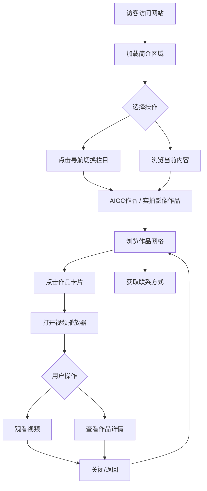

# 影视导演个人作品集网页 - 产品需求文档 (PRD)

## 1. 产品概述

为影视导演张泽龙打造的专业级个人作品集展示平台，集中呈现导演的个人信息、AIGC创作作品及实拍影像作品。该网站面向影视行业从业者、潜在合作方及投资方，旨在通过电影质感的视觉设计与流畅的交互体验，建立专业可信的品牌形象，提升导演在行业内的知名度与影响力。

## 2. 核心功能

### 2.1 用户角色

| 角色 | 访问方式 | 核心权限 |
|------|----------|----------|
| 访客 | 直接访问 | 浏览所有公开内容、观看视频作品、查看联系信息 |
| 导演本人 | 本地文件管理 | 通过更新数据文件管理作品内容 |

### 2.2 功能模块

1. **主导航系统**：响应式导航栏、平滑滚动切换、移动端汉堡菜单
2. **简介栏目**：个人信息展示区、职业形象照片、联系方式卡片
3. **AIGC作品栏目**：视频作品网格布局、自定义视频播放器、作品详情浮层
4. **实拍影像作品栏目**：差异化视觉风格、视频画廊展示、交互式浏览体验

### 2.3 页面功能详情

| 页面名称 | 模块名称 | 功能描述 |
|-----------|----------|----------|
| 全站通用 | 主导航栏 | 固定顶部导航，包含"简介"、"AIGC作品"、"实拍影像作品"三个锚点链接；桌面端水平排列，移动端折叠为汉堡菜单；滚动时自动高亮当前区域 |
| 简介栏目 | 个人信息区 | 展示姓名"张泽龙"、学历背景"中央民族大学研究生·视听与文化传播专业"；采用大标题+副标题层级排版；支持添加职业形象照 |
| 简介栏目 | 联系方式卡片 | 电话13530725369、微信zzl135307以图标+文字形式呈现；悬停时显示复制提示；深色半透明卡片设计 |
| AIGC作品 | 作品展示网格 | 响应式网格布局（桌面3列/平板2列/移动1列）；每个作品卡片包含缩略图预览、标题、简介摘要；悬停时显示播放按钮叠加层 |
| AIGC作品 | 视频播放器 | 自定义控件：播放/暂停、进度条拖拽、音量调节滑块、全屏切换、加载状态指示器；支持MP4/WebM格式；点击卡片或播放按钮触发全屏/内嵌播放模态框 |
| AIGC作品 | 作品详情浮层 | 从底部滑入的详情面板；完整作品简介、创作时间、技术参数等信息；支持关闭返回列表视图 |
| 实拍影像作品 | 作品画廊 | 采用瀑布流或不对称网格布局以示区分；每个作品使用电影胶片边框装饰元素；相同的视频播放器功能但不同的视觉主题色 |
| 实拍影像作品 | 浏览交互 | 支持键盘方向键切换作品；图片灯箱效果；触摸滑动支持 |

## 3. 核心流程

### 3.1 用户访问流程

访客进入网站 → 自动加载简介区域 → 点击导航切换栏目 → 浏览作品列表 → 点击作品触发播放器 → 观看视频或查看详情 → 返回继续浏览或获取联系方式

### 3.2 内容管理流程

导演准备视频素材 → 更新JSON数据文件 → 刷新网页即可看到新内容 → 无需重新部署代码

## 4. 用户界面设计

### 4.1 设计风格

**整体美学定位**：电影工业风 + 现代商务简约

- **主色调**：
  - 背景基础色：`#0a0a0a` (深邃黑)
  - 卡片背景：`#141414` (炭黑)
  - 文字主色：`#f5f5f5` (暖白)
  - 文字次色：`#a0a0a0` (中性灰)

- **强调色方案**：
  - AIGC作品区域：`#00d4ff` (科技蓝) - 体现AI创作的未来感
  - 实拍影像区域：`#ff6b35` (电影橙) - 经典电影胶片色调
  - 导航激活态：渐变 `linear-gradient(135deg, #00d4ff, #ff6b35)`
  - CTA按钮：`#ffd700` (金色) - 用于重要操作

- **字体系统**：
  - 标题字体：'Playfair Display', 衬线体 - 体现电影艺术感
  - 正文字体：'Inter', 无衬线体 - 保证可读性
  - 代码/标签：'JetBrains Mono', 等宽字体 - 技术感点缀

- **设计语言特征**：
  - 大胆的留白与密集内容的对比
  - 微妙的噪点纹理叠加层模拟胶片颗粒感
  - 电影画幅比例 2.39:1 的装饰性分割线
  - 导演板(clapperboard)、胶片卷轴(film reel)等SVG图标作为视觉符号
  - 卡片悬停时的微妙光晕效果(glow)
  - 渐变边框和玻璃拟态(glassmorphism)效果

- **按钮风格**：
  - 主要按钮：圆角矩形(8px)，金色边框 + 半透明填充，悬停时填充变为实心金色
  - 次要按钮：纯文字按钮，下划线动画效果
  - 图标按钮：圆形，悬停时旋转 + 颜色变化

- **布局风格**：
  - 单页应用(SPA)架构，垂直滚动切换section
  - 最大内容宽度：1400px，居中对齐
  - Section间距：120px (桌面) / 80px (平板) / 60px (移动)
  - 卡片间距：24px (grid gap)

### 4.2 各页面UI设计规范

| 页面名称 | 模块名称 | UI元素细节 |
|-----------|----------|------------|
| 简介 | Hero区域 | 全屏高度视差背景(模糊的电影片场图)；大字号姓名(72px/5xl)；副标题(24px/xl)；向下滚动指示箭头动画；左侧文字右侧照片的不对称布局 |
| 简介 | 信息卡片组 | 三张玻璃拟态卡片并排(桌面)/堆叠(移动)：教育背景卡、专业技能卡、联系方式卡；每张卡片带对应图标 |
| AIGC作品 | 区域标题 | 左侧竖线装饰 + "AIGC WORKS"英文 + 中文副标题；科技蓝色调装饰线条；数字计数器动画(作品数量) |
| AIGC作品 | 作品卡片 | 16:9视频预览图；暗色叠加层(透明度0→70%悬停过渡)；居中播放按钮(圆形，脉冲动画)；底部信息栏：标题(左) + 时长标签(右)；悬停时卡片上浮8px + 阴影增强 |
| AIGC作品 | 视频播放模态框 | 全屏黑色背景(透明度95%)；中央16:9播放器容器；底部自定义控制栏；右上角关闭按钮；淡入淡出动画(300ms ease) |
| 实拍影像 | 区域标题 | 与AIGC区域对称设计但使用橙色系；胶片孔洞装饰图案作为背景纹理 |
| 实拍影像 | 作品卡片 | 类似AIGC卡片但增加胶片边框装饰(两侧打孔效果)；悬停时边框发光为橙色；时长标签改为胶片图标样式 |

### 4.3 响应式断点设计

**Desktop-first 设计策略**

| 设备类型 | 断点范围 | 布局调整 |
|----------|----------|----------|
| 桌面端 | ≥1200px | 完整三列网格、水平导航、大尺寸字体、完整特效 |
| 平板端 | 768px-1199px | 两列网格、保持水平导航、中等尺寸字体、简化部分动效 |
| 移动端 | <768px | 单列堆叠、汉堡菜单、缩小字体、禁用复杂动画、优化触摸目标尺寸(≥44px) |

**关键适配点**：
- 导航栏：768px以下转为汉堡菜单 + 侧边抽屉
- 字体大小：标题从72px递减至48px(平板)/32px(移动)
- 网格列数：3→2→1
- 间距：按比例缩减(0.75x / 0.5x)
- 图片：使用 `object-fit: cover` 保持比例
- 视频：移动端优先横屏全屏播放

### 4.4 动效与交互设计

**全局动效原则**：
- 入场动画：staggered reveal (延迟150ms级联)
- 悬停反馈：200ms ease-out 过渡
- 滚动触发：Intersection Observer API 控制元素显现
- 性能预算：单次动画≤60fps，避免layout thrashing

**具体动效清单**：

| 动效名称 | 触发条件 | 持续时间 | 缓动函数 | 描述 |
|----------|----------|----------|----------|------|
| 导航栏滚动隐藏/显示 | 滚动位置>100px | 300ms | cubic-bezier(0.4, 0, 0.2, 1) | 向上滚动显示，向下滚动隐藏 |
| Section入场 | 进入视口 | 600ms | ease-out | 从下方20px位移 + 透明度0→1，子元素级联延迟 |
| 卡片悬停 | 鼠标悬停 | 250ms | ease | translateY(-8px) + box-shadow增强 + 边框发光 |
| 播放按钮脉冲 | 卡片悬停持续 | 1.5s循环 | ease-in-out | scale(1)→scale(1.1)→scale(1) 循环 |
| 播放器打开 | 点击作品 | 300ms | ease-in-out | 模态框scale(0.95)→scale(1) + opacity过渡 |
| 进度条拖拽 | 用户交互 | 实时 | linear | 自定义样式进度条，拖拽手柄放大效果 |
| 页面加载 | 首次加载 | 800ms | ease-out | Logo淡入 + 背景粒子/光效 + 内容staggered reveal |
| 导航锚点切换 | 点击导航项 | 700ms | ease-in-out | smooth scroll + 高亮动画 |
