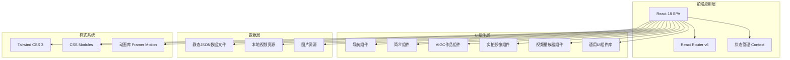
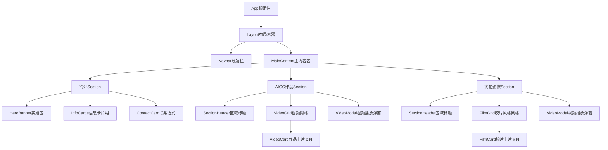

# 影视导演个人作品集网页 - 技术架构文档

## 1. 架构设计

### 1.1 整体架构图



### 1.2 组件层级结构



## 2. 技术选型与描述

### 2.1 前端技术栈

| 技术 | 版本 | 用途说明 |
|------|------|----------|
| React | 18.x | 核心UI框架，函数组件 + Hooks开发模式 |
| Vite | 5.x | 构建工具，快速热更新与优化打包 |
| Tailwind CSS | 3.x | 原子化CSS框架，快速实现响应式设计 |
| Framer Motion | 11.x | React动画库，处理复杂交互动效 |
| React Icons | 5.x | 图标库，提供丰富的矢量图标 |
| react-player | 2.x | 视频播放器封装，支持多格式 |

### 2.2 开发工具链

- **包管理器**: npm / pnpm
- **代码规范**: ESLint + Prettier
- **版本控制**: Git (可选)
- **初始化工具**: `create-vite`

### 2.3 后端与数据存储

本项目采用**纯静态站点**架构，无需后端服务：

- **数据源**: JSON文件 (`src/data/works.json`)
- **媒体存储**: `public/videos/` 和 `public/images/` 目录
- **部署方式**: 可直接部署至 Vercel / Netlify / GitHub Pages 等静态托管平台
- **内容更新**: 导演只需替换视频文件并编辑JSON即可更新内容

## 3. 路由定义

由于是单页应用(SPA)且所有内容在同一页面展示，路由主要用于锚点导航：

| 路由路径 | 对应Section | 说明 |
|----------|-------------|------|
| `/` 或 `/#intro` | 简介区域 | 默认首页，展示个人信息 |
| `/#aigc-works` | AIGC作品区域 | AIGC视频作品列表 |
| `/#real-shot-works` | 实拍影像区域 | 实拍视频作品列表 |

**路由实现方式**：
- 使用 `react-scroll` 库实现平滑锚点滚动
- URL hash变化时自动滚动到对应section
- 监听滚动事件自动更新URL hash和高亮导航项

## 4. 数据模型设计

### 4.1 作品数据结构

```typescript
interface Work {
  id: string;                    // 唯一标识符
  title: string;                 // 作品标题
  category: 'aigc' | 'real-shot'; // 作品分类
  description: string;           // 详细简介
  briefDescription: string;      // 卡片上的简短描述(限50字)
  videoUrl: string;              // 视频文件路径
  thumbnailUrl: string;          // 缩略图路径
  duration: string;              // 视频时长 (如 "03:45")
  createdAt: string;             // 创建日期 (ISO格式)
  tags: string[];                // 标签数组
  technicalInfo?: {              // 可选的技术参数
    resolution?: string;         // 分辨率
    aiTools?: string[];          // AI工具(AIGC类)
    cameraEquipment?: string;    // 拍摄设备(实拍类)
    postSoftware?: string;       // 后期软件
  }
}

interface DirectorProfile {
  name: string;                  // 姓名
  title: string;                 // 职位头衔
  education: string;             // 教育背景
  phone: string;                 // 联系电话
  wechat: string;                // 微信号
  avatarUrl?: string;            // 头像/职业照路径
  bio: string;                   // 个人简介(多行)
  skills: string[];              // 专业技能列表
}
```

### 4.2 示例数据文件结构 (works.json)

```json
{
  "profile": {
    "name": "张泽龙",
    "title": "影视导演",
    "education": "中央民族大学研究生 · 视听与文化传播专业",
    "phone": "13530725369",
    "wechat": "zzl135307",
    "avatarUrl": "/images/avatar.jpg",
    "bio": "...",
    "skills": ["AIGC视频创作", "实拍影像", "后期制作", "视听语言"]
  },
  "aigcWorks": [
    {
      "id": "aigc-001",
      "title": "示例AIGC作品",
      "category": "aigc",
      "description": "详细描述...",
      "briefDescription": "简短描述...",
      "videoUrl": "/videos/aigc-work-001.mp4",
      "thumbnailUrl": "/images/thumbnails/aigc-001.jpg",
      "duration": "05:30",
      "createdAt": "2026-01-15",
      "tags": ["AI生成", "实验短片"],
      "technicalInfo": {
        "resolution": "4K",
        "aiTools": ["Runway", "Midjourney"],
        "postSoftware": "Premiere Pro"
      }
    }
  ],
  "realShotWorks": [
    {
      "id": "real-001",
      "title": "示例实拍作品",
      "category": "real-shot",
      "description": "详细描述...",
      "briefDescription": "简短描述...",
      "videoUrl": "/videos/real-shot-001.mp4",
      "thumbnailUrl": "/images/thumbnails/real-001.jpg",
      "duration": "08:20",
      "createdAt": "2025-12-10",
      "tags": ["纪录片", "人文题材"],
      "technicalInfo": {
        "resolution": "4K",
        "cameraEquipment": "Sony FX3",
        "postSoftware": "DaVinci Resolve"
      }
    }
  ]
}
```

## 5. 项目目录结构

```
08_Project_resume/
├── public/
│   ├── videos/
│   │   ├── aigc/                    # AIGC视频文件
│   │   └── real-shot/               # 实拍视频文件
│   └── images/
│       ├── avatar.jpg               # 导演职业照
│       ├── hero-bg.jpg              # 简介区背景图
│       └── thumbnails/              # 作品缩略图
│           ├── aigc/
│           └── real-shot/
├── src/
│   ├── components/
│   │   ├── layout/
│   │   │   ├── Navbar.jsx           # 导航栏组件
│   │   │   └── Footer.jsx           # 页脚组件
│   │   ├── sections/
│   │   │   ├── IntroSection.jsx     # 简介区域
│   │   │   ├── AIGCSection.jsx      # AIGC作品区域
│   │   │   └── RealShotSection.jsx  # 实拍影像区域
│   │   ├── ui/
│   │   │   ├── VideoCard.jsx        # 通用视频卡片
│   │   │   ├── VideoPlayer.jsx      # 自定义视频播放器
│   │   │   ├── VideoModal.jsx       # 视频播放模态框
│   │   │   ├── SectionHeader.jsx    # 区域标题组件
│   │   │   ├── InfoCard.jsx         # 信息卡片组件
│   │   │   └── LoadingSpinner.jsx   # 加载指示器
│   │   └── icons/                   # 自定义SVG图标组件
│   ├── data/
│   │   └── works.json               # 作品数据文件
│   ├── hooks/
│   │   ├── useScrollSpy.js          # 滚动监听Hook
│   │   └── useVideoPlayer.js        # 视频播放控制Hook
│   ├── styles/
│   │   ├── globals.css              # 全局样式 + Tailwind配置
│   │   └── animations.css           # 自定义动画定义
│   ├── utils/
│   │   └── helpers.js               # 工具函数
│   ├── App.jsx                      # 根组件
│   └── main.jsx                     # 应用入口
├── index.html                       # HTML模板
├── tailwind.config.js               # Tailwind配置
├── vite.config.js                   # Vite构建配置
├── postcss.config.js                # PostCSS配置
├── package.json                     # 项目依赖
└── README.md                        # 使用指南(可选)
```

## 6. 关键技术实现方案

### 6.1 视频懒加载优化策略

**实现方式**：
- 使用 Intersection Observer API 监测视频卡片是否进入可视区域
- 仅当卡片距离视口 < 500px 时才加载 thumbnail 图片
- 点击播放时才真正加载视频源(将 `src` 属性动态赋值)
- 已离开视口的视频自动暂停并释放内存

**性能指标目标**：
- 首屏加载时间(LCP) < 2.5s
- 累积布局偏移(CLS) < 0.1
- 首次输入延迟(FID) < 100ms

### 6.2 自定义视频播放器实现

**核心功能模块**：
1. **播放/暂停控制**: 切换播放状态，显示对应图标
2. **进度条**: 
   - 可拖拽的进度指示器
   - 显示已缓冲进度(灰色)和当前播放进度(彩色)
   - 悬停时显示时间提示tooltip
3. **音量控制**: 垂直滑块，点击静音图标切换
4. **全屏切换**: 支持浏览器原生全屏API
5. **播放速度**: 可选 0.5x / 1x / 1.5x / 2x
6. **画中画**(可选): 支持PiP API

**UI定制**：
- 控制栏在无操作3秒后自动隐藏
- 鼠标移动或触摸时重新显示
- 使用CSS变量匹配不同区域的主题色

### 6.3 响应式布局实现

**Tailwind断点配置**：
```javascript
// tailwind.config.js 扩展断点
screens: {
  'sm': '640px',
  'md': '768px',
  'lg': '1024px',
  'xl': '1280px',
  '2xl': '1400px'  // 内容最大宽度
}
```

**网格自适应**：
- AIGC/实拍作品网格: `grid-cols-1 md:grid-cols-2 xl:grid-cols-3`
- 信息卡片: `grid-cols-1 md:grid-cols-3`
- 使用 `gap-6` (24px) 统一间距

### 6.4 动画系统架构

**Framer Motion 配置**：

```javascript
// 全局动画预设
const fadeInUp = {
  initial: { opacity: 0, y: 30 },
  animate: { opacity: 1, y: 0 },
  transition: { duration: 0.6, ease: "easeOut" }
};

const staggerContainer = {
  animate: {
    transition: {
      staggerChildren: 0.15,
      delayChildren: 0.1
    }
  }
};

// 滚动触发动画
const whileInView = {
  once: true,  // 只触发一次
  margin: "-100px"  // 提前触发
};
```

**性能优化**：
- 使用 `transform` 和 `opacity` 实现动画(GPU加速)
- 避免动画触发重排(reflow)
- 移动端减少动画数量或降低帧率
- 尊重用户的 `prefers-reduced-motion` 系统设置

## 7. 浏览器兼容性与性能预算

### 7.1 目标浏览器

- Chrome/Edge ≥ 90
- Firefox ≥ 88
- Safari ≥ 14
- iOS Safari ≥ 14
- Android Chrome ≥ 90

### 7.2 性能预算

| 指标 | 目标值 | 优化手段 |
|------|--------|----------|
| 首次内容绘制(FCP) | < 1.5s | 代码分割、资源预加载 |
| 最大内容绘制(LCP) | < 2.5s | 图片懒加载、视频延迟加载 |
| 累积布局偏移(CLS) | < 0.1 | 固定尺寸容器、字体display:swap |
| 总包体积(gzip) | < 500KB | Tree-shaking、按需引入 |
| JavaScript执行时间 | < 3s | 减少主线程阻塞、Web Worker(如需) |

## 8. 部署与维护指南

### 8.1 本地开发

```bash
# 安装依赖
npm install

# 启动开发服务器 (http://localhost:5173)
npm run dev

# 生产环境构建
npm run build

# 预览生产构建
npm run preview
```

### 8.2 内容更新流程

1. **添加新视频**：
   - 将视频文件放入 `public/videos/aigc/` 或 `public/videos/real-shot/`
   - 制作缩略图放入 `public/images/thumbnails/对应分类/`
   
2. **编辑数据**：
   - 打开 `src/data/works.json`
   - 在对应数组中添加新的作品对象
   - 填写完整的元数据信息
   
3. **测试验证**：
   - 本地运行 `npm run dev` 预览效果
   - 确认视频正常播放、信息正确显示
   
4. **部署上线**：
   - 运行 `npm run build` 生成生产文件
   - 将 `dist/` 目录内容上传至服务器

### 8.3 推荐托管平台

- **Vercel**: 零配置部署，支持自定义域名，全球CDN
- **Netlify**: 同样简单，支持表单处理(如需联系表单)
- **GitHub Pages**: 免费托管，适合开源项目展示
- **阿里云OSS / 腾讯云COS**: 国内访问速度快，适合视频资源存储
